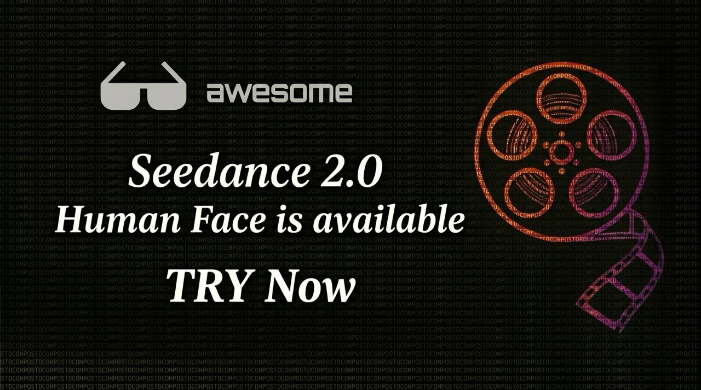

[English](./README.md) | [简体中文](./README.zh-CN.md) | [繁體中文](./README.zh-TW.md) | [Español](./README.es.md) | [Deutsch](./README.de.md) | [Français](./README.fr.md) | [日本語](./README.ja.md) | [한국어](./README.ko.md) | [Türkçe](./README.tr.md) | [Русский](./README.ru.md)

# Seedance 2.5 Gateway Service: Preise, Modelle und Leitfaden zur Videogenerierung

<p align="center">
  <a href="https://evolink.ai/launch/seedance-2-5?utm_source=github&utm_medium=banner&utm_campaign=Seedance-2.5-Gateway-Service">
    
  </a>
</p>

<p align="center">
  <strong>Seedance 2.5 Early Access<br>Current Seedance 2 API Path<br>Get Early Access</strong>
</p>

<p align="center">
  Seedance 2.0 Gateway Service Preise, Modelle, Text-to-Video, Image-to-Video und Reference-to-Video in einer einzigen Anleitung.
</p>

<p align="left">
  <a href="https://evolink.ai/launch/seedance-2-5?utm_source=github&utm_medium=readme&utm_campaign=Seedance-2.5-Gateway-Service">Seedance 2.5 Preise ansehen</a> ·
  <a href="https://evolink.ai/signup?utm_source=github&utm_medium=readme&utm_campaign=seedance-2-api">API-Key erhalten</a> ·
  <a href="https://docs.evolink.ai?utm_source=github&utm_medium=readme&utm_campaign=seedance-2-api">API-Dokumentation lesen</a>
</p>

## Was ist der Seedance 2.5 Gateway Service?

Der Seedance 2.0 Gateway Service ist ein Video-Generierungs-Gateway-Service für KI-Videos aus Text-Prompts, Bildern und multimodalen Referenzen. Über EvoLink.ai können Entwickler auf die gesamte Seedance-2.0-Modellfamilie mit einem einheitlichen API-Workflow zugreifen:

- einen Generierungs-Task erstellen
- sofort eine Task-ID erhalten
- Status abfragen oder einen Callback empfangen
- das fertige Video herunterladen

Dieses Repository richtet sich an Entwickler, die:

- die Preise des Seedance 2.0 Gateway Service und Modellunterschiede verstehen wollen
- Text-to-Video, Image-to-Video und Reference-to-Video vergleichen möchten
- den Unterschied zwischen Standard- und Fast-Modellen verstehen wollen
- produktionsreife Beispiele kopieren möchten
- Kosten vor dem Rollout abschätzen wollen
- weitere Seedance-Ressourcen im EvoLinkAI-GitHub-Ökosystem entdecken möchten

## Unterstützte Seedance-2.0-Modelle

### Standardmodelle

- `seedance-2.0-text-to-video`
- `seedance-2.0-image-to-video`
- `seedance-2.0-reference-to-video`

### Fast-Modelle

- `seedance-2.0-fast-text-to-video`
- `seedance-2.0-fast-image-to-video`
- `seedance-2.0-fast-reference-to-video`

## Schnellstart

> [!NOTE]
> **Get Seedance 2.5 Early Access:** Seedance 2.5 early access is open through EvoLink. Use the current Seedance 2 API path while the 2.5 rollout is opening: https://evolink.ai/launch/seedance-2-5?utm_source=github&utm_medium=readme&utm_campaign=Seedance-2.5-Gateway-Service

```bash
curl --request POST \
  --url https://api.evolink.ai/v1/videos/generations \
  --header "Authorization: Bearer ${EVOLINK_API_KEY}" \
  --header 'Content-Type: application/json' \
  --data '{
    "model": "seedance-2.0-text-to-video",
    "prompt": "Eine filmische Luftaufnahme einer futuristischen Stadt bei Sonnenaufgang, weiche Wolken, reflektierende Hochhäuser, fließende Kamerabewegung",
    "duration": 5,
    "quality": "720p",
    "aspect_ratio": "16:9",
    "generate_audio": true
  }'
```

## Einheitlicher API-Workflow

### 1. Generierungs-Task erstellen

```http
POST https://api.evolink.ai/v1/videos/generations
```

### 2. Task-Status abfragen

```http
GET https://api.evolink.ai/v1/tasks/{task_id}
```

### 3. Ergebnisse abrufen

Nach Abschluss liefert die Antwort die generierten Video-URLs.

### 4. Optionaler Callback

Du kannst `callback_url` mitsenden, wenn du nicht nur pollen möchtest.

## Modellvergleich

| Modell | Eingabetyp | Geeignet für | Hinweise |
|---|---|---|---|
| `seedance-2.0-text-to-video` | nur Text | promptbasierte Videogenerierung | unterstützt optional web search |
| `seedance-2.0-image-to-video` | 1-2 Bilder | Animation des ersten Frames oder Start/End-Frame-Übergang | ideal für Bildanimations-Workflows |
| `seedance-2.0-reference-to-video` | Bilder, Videos, Audio, Text | fortgeschrittene multimodale Generierung und Bearbeitung | ideal für Bearbeitung, Verlängerung und kontrollierte Generierung |
| `seedance-2.0-fast-text-to-video` | nur Text | schnellere Prompt-Iteration | gleiches Grundmuster wie das Standardmodell |
| `seedance-2.0-fast-image-to-video` | 1-2 Bilder | schnellere Bildanimation | unterstützt mehr Bildformate |
| `seedance-2.0-fast-reference-to-video` | Bilder, Videos, Audio, Text | schnellere multimodale Generierung | starke Wahl für schnelle Iteration |

## Zentrale Parameter

| Parameter | Typ | Beschreibung |
|---|---|---|
| `model` | string | wählt das Seedance-2.0-Modell |
| `prompt` | string | Generierungs-Prompt |
| `duration` | integer | Ausgabelänge, `4-15` Sekunden oder `-1` für intelligente Dauer |
| `quality` | string | `480p` oder `720p` |
| `aspect_ratio` | string | `16:9`, `9:16`, `1:1`, `4:3`, `3:4`, `21:9` oder `adaptive` |
| `generate_audio` | boolean | ob synchrones Audio erzeugt werden soll |
| `callback_url` | string | optionale HTTPS-Callback-URL |

## Leitfaden nach Modus

### Text to Video

Verwende `seedance-2.0-text-to-video` oder `seedance-2.0-fast-text-to-video`, wenn du ein Video nur aus Text erzeugen möchtest.

Wichtige Punkte:
- keine Bild-, Video- oder Audioeingaben
- unterstützt optional `model_params.web_search`
- gut für Konzeptgenerierung und aktuelle Inhalte

### Image to Video

Verwende `seedance-2.0-image-to-video` oder `seedance-2.0-fast-image-to-video`, wenn du ein oder zwei Bilder animieren möchtest.

Wichtige Punkte:
- `image_urls` akzeptiert 1-2 Bilder
- 1 Bild = Animation ab erstem Frame
- 2 Bilder = Übergang vom ersten zum letzten Frame

### Reference to Video

Verwende `seedance-2.0-reference-to-video` oder `seedance-2.0-fast-reference-to-video`, wenn du maximale Kontrolle brauchst.

Wichtige Punkte:
- unterstützt `image_urls`, `video_urls` und `audio_urls`
- kann neue Ergebnisse aus multimodalen Referenzen erzeugen
- kann Videos verlängern, bearbeiten oder neu zusammensetzen
- Referenzvideo-Laufzeit beeinflusst die Abrechnung

## Seedance 2.0 Gateway Service Preise

### Ausgabepreise

```text
Kosten = Ausgabedauer des Videos × Preis pro Auflösung
```

| Auflösung | Preis |
|---|---:|
| `480p` | 4.63 Credits / Sekunde |
| `720p` | 10.00 Credits / Sekunde |

### Preise für Reference-to-Video

```text
Kosten = (Länge der Referenzvideos + Länge des Ausgabevideos) × Preis pro Auflösung
```

### Zusätzliche Hinweise

- Audioerzeugung kostet nichts extra
- `web_search` kostet `0.04` Credits pro tatsächlicher Suche
- intelligente Dauer `-1` reserviert zunächst 10 Sekunden
- 1 Credit = 10,000 UC = ¥0.10

## Beispielanfragen

### Text-to-Video-Beispiel

```bash
curl --request POST \
  --url https://api.evolink.ai/v1/videos/generations \
  --header "Authorization: Bearer ${EVOLINK_API_KEY}" \
  --header 'Content-Type: application/json' \
  --data '{
    "model": "seedance-2.0-text-to-video",
    "prompt": "Eine Makroaufnahme eines Glasfroschs auf einem grünen Blatt, Fokus auf den transparenten Körper und das sichtbare schlagende Herz",
    "duration": 8,
    "quality": "720p",
    "aspect_ratio": "16:9",
    "generate_audio": true
  }'
```

### Image-to-Video-Beispiel

```bash
curl --request POST \
  --url https://api.evolink.ai/v1/videos/generations \
  --header "Authorization: Bearer ${EVOLINK_API_KEY}" \
  --header 'Content-Type: application/json' \
  --data '{
    "model": "seedance-2.0-image-to-video",
    "prompt": "Die Kamera fährt langsam näher heran, während das Standbild lebendig wird",
    "image_urls": ["https://example.com/first-frame.jpg"],
    "duration": 5,
    "aspect_ratio": "adaptive"
  }'
```

### Reference-to-Video-Beispiel

```bash
curl --request POST \
  --url https://api.evolink.ai/v1/videos/generations \
  --header "Authorization: Bearer ${EVOLINK_API_KEY}" \
  --header 'Content-Type: application/json' \
  --data '{
    "model": "seedance-2.0-reference-to-video",
    "prompt": "Verwende die Kamerabewegung aus Video 1 und Audio 1 als Hintergrundmusik",
    "image_urls": ["https://example.com/ref1.jpg"],
    "video_urls": ["https://example.com/reference.mp4"],
    "audio_urls": ["https://example.com/bgm.mp3"],
    "duration": 10,
    "quality": "720p",
    "aspect_ratio": "16:9",
    "generate_audio": true
  }'
```

## Einsatzbereiche

- KI-Video-Apps
- kreative Tools und Editor-Workflows
- Bildanimations-Pipelines
- Werbevideo-Generierung
- Social-Media-Content
- Produktdemos
- multimodale Videobearbeitung
- Prototyping und Konzeptvisualisierung

## FAQ

### Ist der Seedance 2.0 Gateway Service synchron?
Nein. Seedance 2.0 arbeitet asynchron mit Tasks.

### Was ist der Unterschied zwischen Standard- und Fast-Modellen?
Fast-Modelle verwenden das gleiche Anfrageformat, sind aber für schnellere Iteration optimiert.

### Kann ich Video nur aus Text erzeugen?
Ja. Verwende `seedance-2.0-text-to-video` oder `seedance-2.0-fast-text-to-video`.

### Kann ich ein Bild animieren oder einen Start/End-Frame-Übergang erzeugen?
Ja. Verwende image-to-video.

### Kann ich ein vorhandenes Video bearbeiten oder verlängern?
Ja. Verwende reference-to-video mit `video_urls`.

### Beeinflussen Referenzen die Kosten?
Ja. Die Laufzeit der Referenzvideos wird bei reference-to-video mitberechnet.

### Wie lange bleiben die Ergebnis-URLs gültig?
Die generierten Video-URLs sind 24 Stunden gültig.

## Repository-Struktur

```text
Seedance-2.5-Gateway-Service/
├── README.md
├── README.zh-CN.md
├── README.zh-TW.md
├── README.es.md
├── README.de.md
├── README.fr.md
├── README.ja.md
├── README.ko.md
├── README.tr.md
├── README.ru.md
├── assets/
│   └── banner.jpg
├── docs/
│   ├── text-to-video.md
│   ├── image-to-video.md
│   ├── reference-to-video.md
│   ├── fast-models.md
│   └── pricing.md
└── examples/
    ├── curl/
    ├── nodejs/
    └── python/
```

## Verwandte Seedance-Repositories

- [Seedance 2.5 Gateway Service: Early Access and Current API Path](https://github.com/EvoLinkAI/Seedance-2.5-Gateway-Service)
- [Seedance 2 Video Gen Skill for OpenClaw](https://github.com/EvoLinkAI/seedance2-video-gen-skill-for-openclaw)
- [Awesome Seedance 2 Guide](https://github.com/EvoLinkAI/awesome-seedance-2.5-guide)

## Verwandte Links

- [Seedance 2.5 Early Access](https://evolink.ai/launch/seedance-2-5?utm_source=github&utm_medium=readme&utm_campaign=Seedance-2.5-Gateway-Service)
- [Get API Key](https://evolink.ai/signup?utm_source=github&utm_medium=readme&utm_campaign=seedance-2-api)
- [EvoLink.ai](https://evolink.ai?utm_source=github&utm_medium=readme&utm_campaign=seedance-2-api)

> Bitte prüfen Sie die [Regionale Verfügbarkeit](./docs/regional-availability.de.md) vor der Integration.

## Lizenz

MIT

---

> **Now Available:** Du kannst die Integration schon jetzt anhand der Dokumentation vorbereiten. Sobald der Seedance Gateway Service offiziell geöffnet wird, benachrichtigen wir Early-Access-Nutzer.
